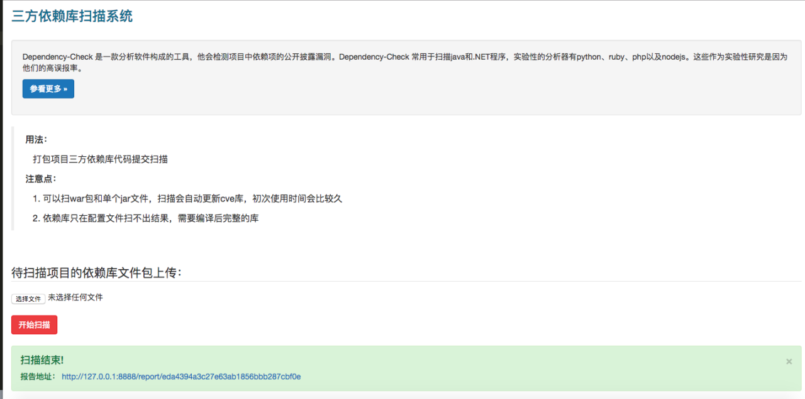

# dcweb
Dependency-Check 是一款分析软件构成的工具，他会检测项目中依赖项的公开披露漏洞，常用于扫描java和.NET项目。本项目就是基于此工具的包装。

# 目标
用于检测项目中使用依赖库的安全性。根据公司业务的情况：

1. 对接代码管理平台，自动化扫描
2. 业务提交扫描工单，安全人员帮助扫描和给修复建议
3. 业务自行提交扫描

如果公司代码发布不多，推荐使用第二种方法，安全人员好跟进并给出针对性建议。

# 安装
### 普通安装
```
1. git clone git@github.com:he1m4n6a/dcweb.git
2. pip -r requirements.txt
3. 从 https://bintray.com/jeremy-long/owasp/dependency-check 下载dependency-check最新二进制版本，放到dcweb/dependency-check目录下
4. apt-get install default-jdk 安装java环境
5. python manage.py runserver 0.0.0.0:8888 运行即可
```

### docker安装
```
1. cd docker-deploy
2. docker build
3. docker up -d
```

默认运行在localhost和8888端口，开启debug，改其他配置修改dcweb/settings.py文件

# 使用方法

把包含三方依赖库的源码打包上传,点击开始扫描即可。

# todo
项目中还有很多地方可以优化和补充，后续如果大家如果有需求或者别的想法可以进行补充。

1. 添加报告结果分析并发送邮件
2. 添加网页接口鉴权
